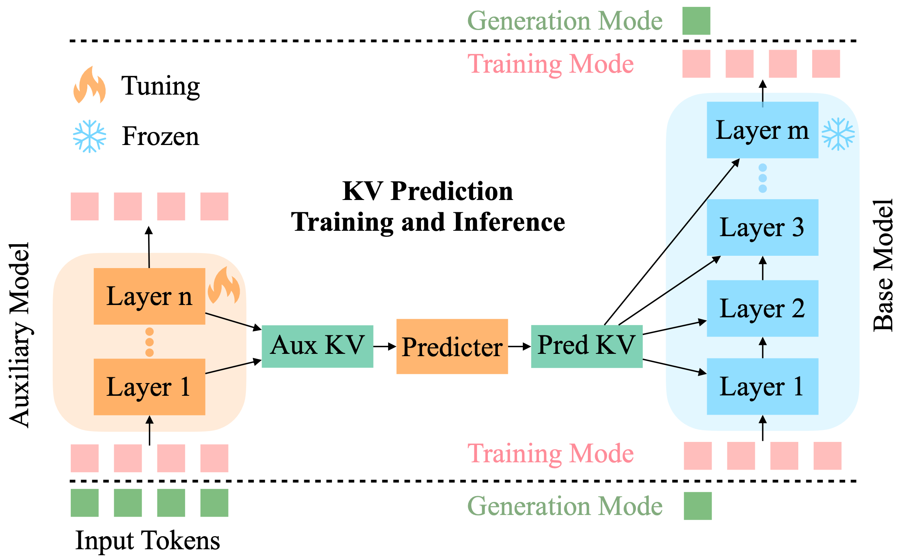

# KV Prediction For Improved Time To First Token

[KV Prediction](TODO @mchorton add link) is a method for improving the time to first token (TTFT) of transformer models. It uses a small "auxiliary" transformer network to process the prompt efficiently. It then uses the KV cache of the auxiliary network to predict the KV cache of a larger "base" network. The base network is then used for inference without the need to query the auxiliary model again during autoregressive generation. Our method creates a pareto-optimal efficiency-accuracy trade-off for TTFT compared to baselines on benchmark datasets. See our paper for details.

<p align="center">

</p>

## Training

We experiment with OpenELM models. Configs are located in the `openelm/` subdirectory. We used multinode training jobs with 8 nodes and 8 H100 GPUs per node.

An example command for training on the `i-th` node is

```bash
export CFG_FILE="PATH_TO_KV_PREDICTION_MODEL_CONFIGURATION_FILE"
export RANK=<NODE_ID> * <NUM_GPUS_PER_NODE>
export WORLD_SIZE=<NUM_NODES> * <NUM_GPUS_PER_NODE>
corenet-train --common.config-file $CFG_FILE --ddp.rank $RANK --ddp.world-size $WORLD_SIZE --ddp.dist-url 'tcp://IP_OF_NODE0:FREEPORT'
```

## Evaluation

We evaluate in the [LM Eval Harness](https://github.com/EleutherAI/lm-evaluation-harness) on commit `3196e907fa195b684470a913c7235ed7f08a4383`. We use the prompt template in `triviaqa-template.yaml`, since we noticed that the default template added an extra question mark to the question.

## Citation

If you find our work useful, please cite:

```BibTeX
@article{
  TODO(mchorton): Add citation
}

@inproceedings{mehta2022cvnets, 
     author = {Mehta, Sachin and Abdolhosseini, Farzad and Rastegari, Mohammad}, 
     title = {CVNets: High Performance Library for Computer Vision}, 
     year = {2022}, 
     booktitle = {Proceedings of the 30th ACM International Conference on Multimedia}, 
     series = {MM '22} 
}
```
